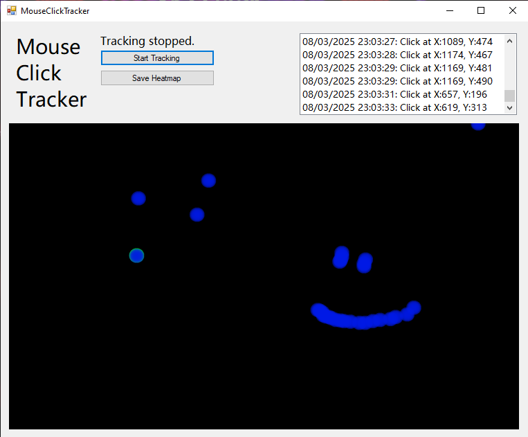

# MouseClickTracker

A neat little tool to track mouse clicks on your screen.
It has no real use, but it's a fun little project to play with.
It's written in C# using the Windows API. It also has a simple GUI
made with Windows Forms. It logs mouse clicks and displays them in a
heatmap. The heatmap can be saved as an image file.

You can download the source code or the latest release from [here](https://github.com/hasderhi/MouseClickTracker).
Released under the MIT License. See the LICENSE file for details.

# tk_dev - Software with passion!
